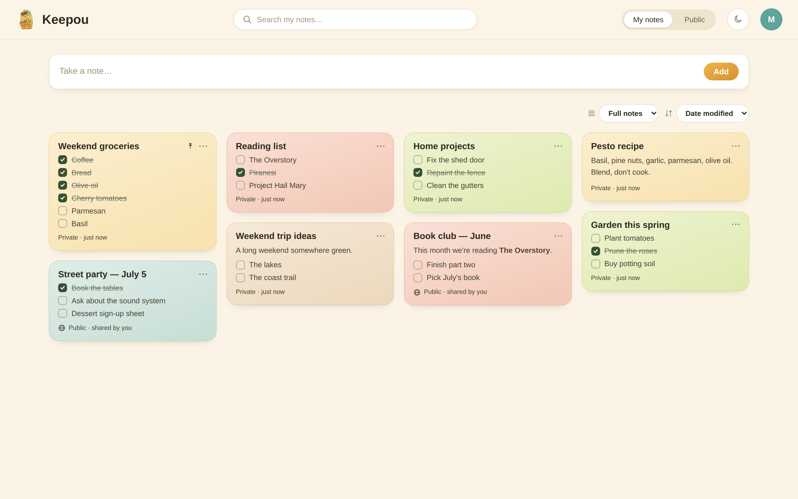
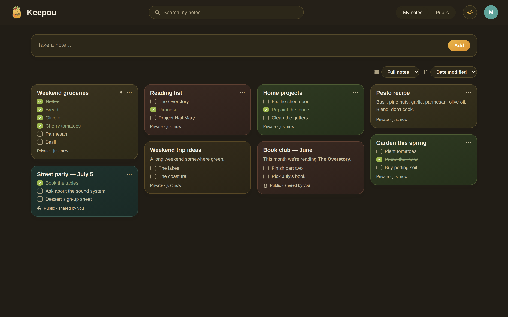
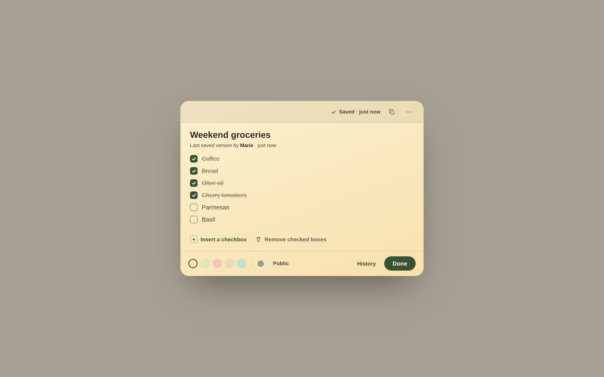
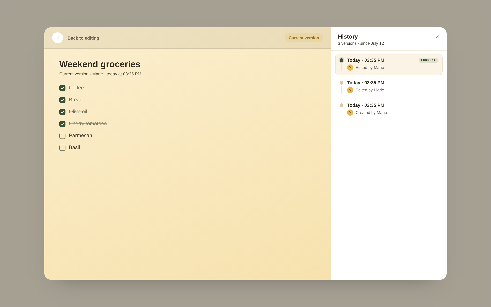
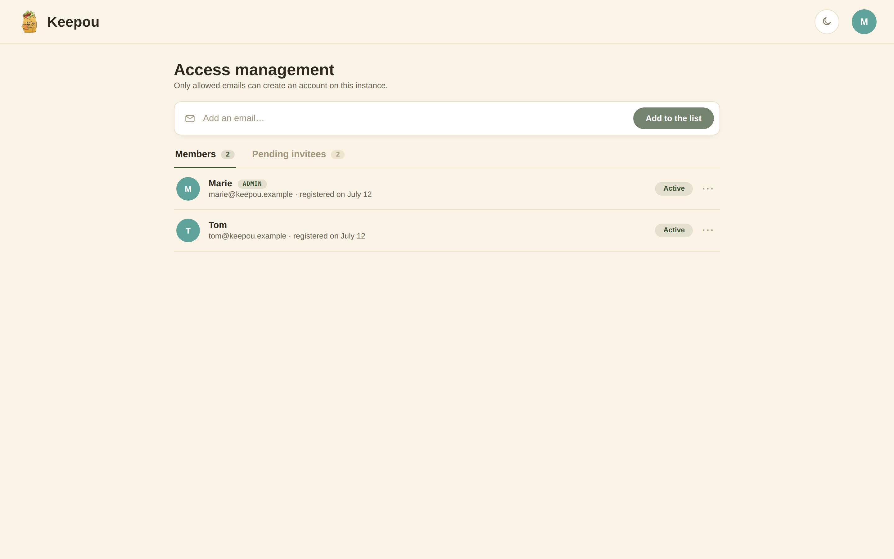
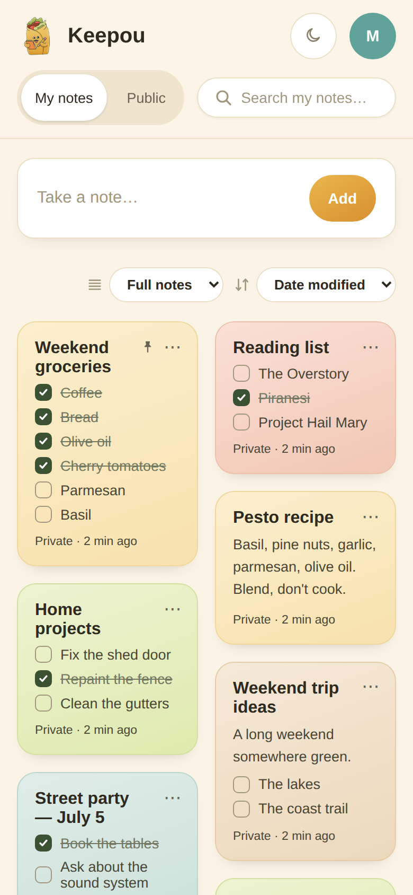

# Keepou

Self-hosted notes for a small group — text and checklists, private or shared,
with version history and an admin-managed allowlist. Think Google Keep, but on
your own server. Installable PWA, light and dark, works on desktop and mobile.

[](https://github.com/ouapps/keepou/actions/workflows/ci.yml)
[](https://github.com/ouapps/keepou/actions/workflows/docker.yml)
[](./LICENSE)


> Keepou's interface is available in **French and English** — it was built for a
> francophone community, with French as the default. The code, the docs and this
> README are in English.



## Screenshots

<table>
  <tr>
    <td width="50%"><br/><sub>Board, dark mode</sub></td>
    <td width="50%"><br/><sub>Editor — one person edits at a time, autosave</sub></td>
  </tr>
  <tr>
    <td width="50%"><br/><sub>Version history</sub></td>
    <td width="50%"><br/><sub>Access management (allowlist)</sub></td>
  </tr>
</table>

<p align="center"><br/><sub>Mobile</sub></p>

## Features

- **Notes with checklists.** Free text mixed with checkboxes. Bodies are stored
  as Markdown (GFM task lists), so nothing is locked into a proprietary format.
- **Private or shared.** Each note is private or public; public notes are visible
  to everyone on the instance. Switching back and forth is one click.
- **One editor at a time.** A note is locked while someone edits it — no silent
  overwrites, no merge conflicts, no CRDT machinery. Others see it read-only and
  can take over once the lock is free.
- **Version history.** Each editing session is saved as a version. You can read
  an old version and restore it; restoring creates a new version, so nothing is
  ever lost.
- **Admin-managed allowlist.** Only invited emails can register. Admins manage
  members and pending invites, and can disable an account (accounts are disabled,
  never deleted).
- **Import from Google Keep.** Bring notes over from a Google Takeout export,
  reviewing and picking which ones to keep.
- **Bilingual (French / English).** Each member picks their language from the
  account menu; the choice is saved to their profile and follows them across
  devices.
- **Agent access over MCP.** Generate a Personal Access Token and connect an AI
  agent (over the Model Context Protocol) to read and manage your notes — handy
  for a future WhatsApp/Telegram bot. See
  [`docs/HOWTO-mcp-agent.md`](./docs/HOWTO-mcp-agent.md).
- **Installable PWA.** Add it to a phone home screen; light and dark themes,
  responsive from mobile to desktop.

## Self-hosting

Keepou runs as three containers: the API, the web front-end (nginx), and
PostgreSQL. You need [Docker](https://docs.docker.com/get-docker/) with the
Compose plugin.

```bash
git clone https://github.com/ouapps/keepou.git
cd keepou
cp .env.example .env
# edit .env and set SESSION_SECRET — e.g. `openssl rand -base64 48`
docker compose up -d
```

The app is then on <http://localhost:8080>. The web container serves the SPA and
proxies `/api` to the back-end, so there's a single origin and no CORS to set up.
Database migrations run automatically when the API container starts.

**First run.** The first account you create becomes the admin and bypasses the
allowlist. Everyone else has to be added to the allowlist (from the admin screen)
before they can register.

**Behind a domain.** Point a reverse proxy (Caddy, Traefik, nginx…) at the web
container, terminate TLS there, and set `APP_ORIGIN` in `.env` to your public URL.

**Data.** PostgreSQL data lives in the `db-data` volume — back that up.

**Updating.**

```bash
git pull
docker compose up -d --build
```

Prebuilt images are also published to the GitHub Container Registry on every
merge to `main`: `ghcr.io/ouapps/keepou-api` and `ghcr.io/ouapps/keepou-web`.

## How it works

A few deliberate choices shape the app:

- **Single-editor lock, not real-time co-editing.** Simpler and predictable for a
  small group; no CRDT/OT, no conflict resolution.
- **One editing session = one version.** History is append-only and restore never
  overwrites.
- **Disable, never delete accounts.** Access is revoked by disabling; the record
  stays.
- **Security lives on the server.** The allowlist, the admin role and the lock are
  all enforced by the API. The front-end just renders what the API allows.

## Tech stack

| Layer | Tech |
|---|---|
| Front-end | React + TypeScript (Vite), React Router |
| Back-end | FastAPI, SQLModel (SQLAlchemy + Pydantic), Alembic |
| Database | PostgreSQL (SQLite in local dev) |
| Auth | JWT bearer (email + password, bcrypt), server-side allowlist |
| Notes | Markdown (GFM task lists) |

## Development

The two apps run independently; the Vite dev server proxies `/api` to the API.

**Back-end** (`api/`) — managed with [uv](https://docs.astral.sh/uv/):

```bash
cd api
uv sync
uv run alembic upgrade head                # creates the local SQLite DB
uv run uvicorn app.main:app --reload       # http://localhost:8000
```

**Front-end** (`web/`):

```bash
cd web
npm install
npm run dev                                # http://localhost:5173
```

Quality checks (the same ones CI runs):

| | Back-end (`api/`) | Front-end (`web/`) |
|---|---|---|
| Lint | `uv run ruff check .` | `npm run lint` |
| Format | `uv run ruff format --check .` | `npm run format` |
| Types | `uv run ty check` | `npm run typecheck` |
| Tests | `uv run pytest` | `npm run test` |

## Documentation

- [`docs/PRD.md`](./docs/PRD.md) — product scope and requirements.
- [`docs/ARCHITECTURE.md`](./docs/ARCHITECTURE.md) — data model, auth, locking,
  history, API surface, deployment.
- [`design/HANDOFF.md`](./design/HANDOFF.md) — design system and the French UI copy.
- [`docs/HOWTO-import-google-keep.md`](./docs/HOWTO-import-google-keep.md) — the
  Google Keep import.
- [`docs/HOWTO-mcp-agent.md`](./docs/HOWTO-mcp-agent.md) — connect an AI agent to
  your notes over MCP.

The [`docs/internal/`](./docs/internal/) folder keeps the original planning notes
(epics and stories); it's history, not something you need to run Keepou.

## Contributing

See [CONTRIBUTING.md](./CONTRIBUTING.md). In short: English for code and docs,
French for the UI copy, and keep the security checks on the server.

## Security

Found a vulnerability? See [SECURITY.md](./SECURITY.md) for how to report it
privately.

## License

[AGPL-3.0](./LICENSE). If you run a modified version as a network service, the
license requires you to offer your users the modified source.
