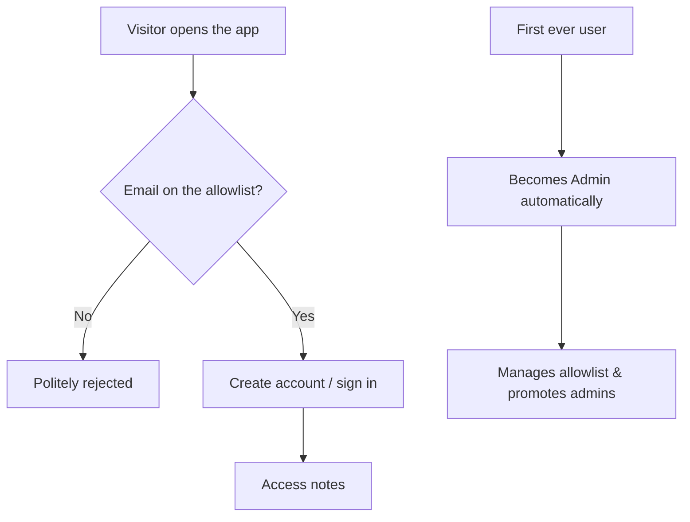

# Keepou

> A simple, self-hosted, multi-user alternative to Google Keep — with private
> and shared public notes, a single-editor lock for safe collaboration, and full
> note history.

**Status:** 📐 _Specification & design phase._ This repository currently
contains the product and architecture specs. Application code follows once the
UI is designed (with Claude Design).

**License:** [AGPL-3.0](./LICENSE)

---

## What is Keepou?

Keepou is a minimalist note-taking app you host yourself for a small group — a
family, a team, a community. It keeps the spirit of Google Keep (fast, simple,
colorful cards) while adding what a self-hosted multi-user tool needs:

- **Private or public notes.** A private note is yours alone. A public note is
  visible **and editable by every member**.
- **One editor at a time on public notes.** A lightweight lock prevents two
  people from clobbering each other; if a note is busy, you're gently asked to
  wait.
- **Full history.** Every save is recorded with its author and timestamp, so you
  can see who changed what and when.
- **Invite-only by design.** Access is gated by an admin-managed email
  allowlist. The first user to sign up becomes the admin.
- **Installable PWA.** Works on phone and desktop, responsive, installable to the
  home screen.

## How access works (in one picture)

## Documentation

| Document | What's inside |
| --- | --- |
| [docs/PRD.md](./docs/PRD.md) | Product vision, personas, scope, and requirements |
| [docs/ARCHITECTURE.md](./docs/ARCHITECTURE.md) | System design, data model, locking, history, API, deployment |

## Tech stack (planned)

| Layer | Choice |
| --- | --- |
| Frontend | Next.js (App Router) + React, responsive, **PWA** |
| Backend | Next.js Route Handlers (same project) |
| Database | **PostgreSQL** via Prisma |
| Auth | Email/password, hashed, DB-backed sessions |
| Hosting | **Railway** (managed Postgres plugin) |

See [docs/ARCHITECTURE.md](./docs/ARCHITECTURE.md) for the rationale.

## Contributing

Keepou is licensed under the **GNU Affero General Public License v3.0**. If you
run a modified version as a network service, the AGPL requires you to offer your
users the corresponding source. See [LICENSE](./LICENSE).
