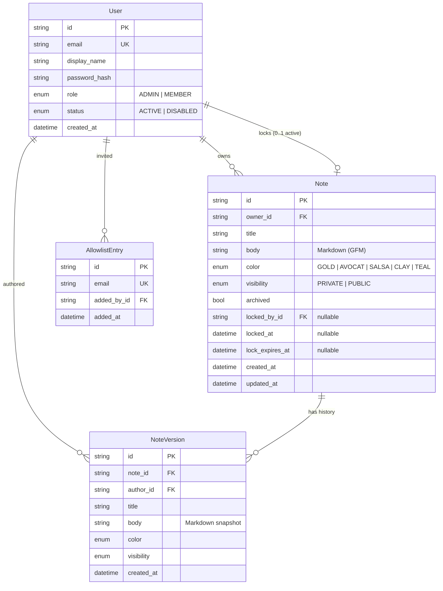
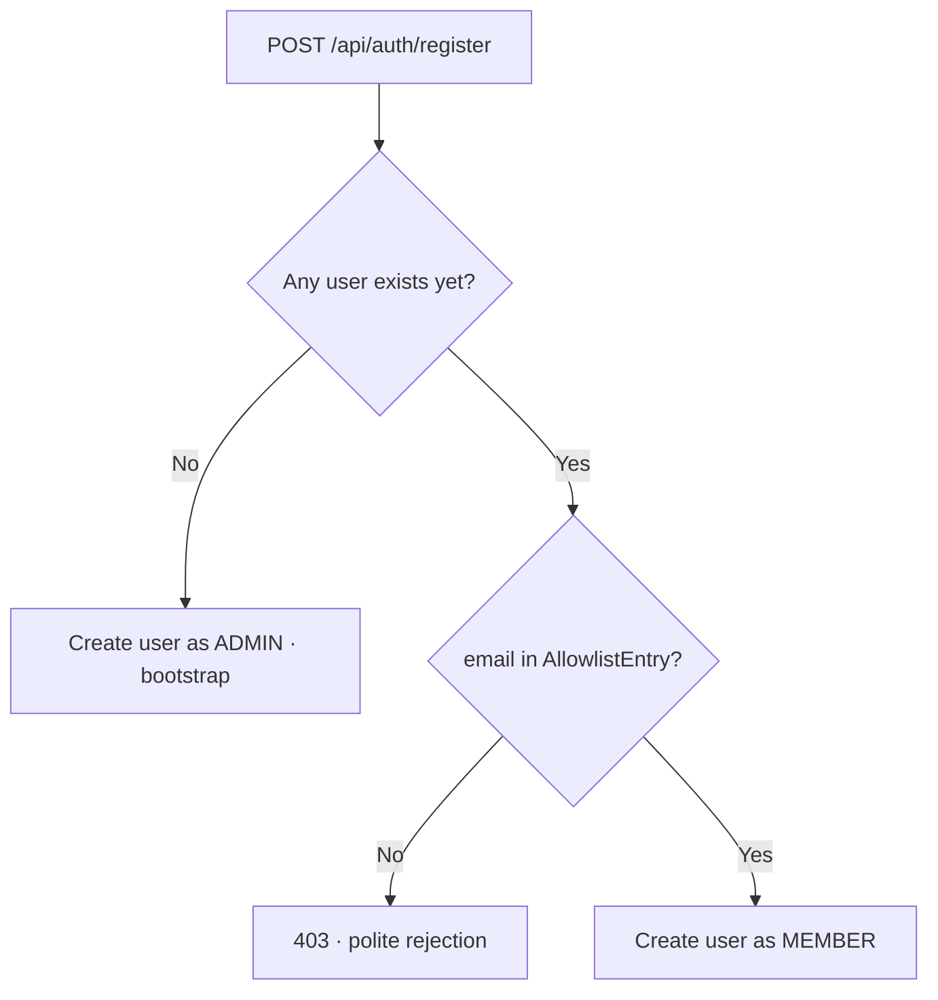
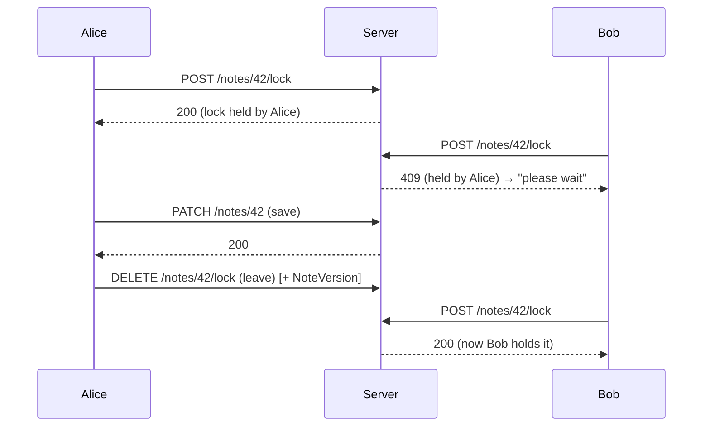

# Keepou — Architecture

**Status:** Reviewed · **Last updated:** 2026-07-01

This document describes the technical design behind the requirements in
[PRD.md](./PRD.md). It is aligned with the validated design
([../design/HANDOFF.md](../design/HANDOFF.md)) and the `api/` + `web/` scaffold.

---

## 1. Overview

Keepou is a **decoupled** application: a React single-page app (the client)
talks to a FastAPI backend (the API) over REST/JSON, backed by one PostgreSQL
database. Both run on Railway as **two services** plus the managed Postgres
plugin.


There is **no SSR**: the frontend is a static Vite build served on its own
service; the API is a separate FastAPI service on its own domain. The front calls
the API **cross-origin** and authenticates with a **JWT bearer token** in the
`Authorization` header (see §8) — no cookies, so no custom domain or reverse proxy
is needed and CORS is straightforward. Keeping the two apart makes the API
reusable and the front trivially cacheable (see §10).

## 2. Stack & rationale

| Concern | Choice | Why |
| --- | --- | --- |
| Frontend | **React + TypeScript (Vite SPA)** | Fast dev/build, decoupled from the API, easy PWA. |
| Backend | **Python + FastAPI** | Typed, small, great for a REST API; first-class Pydantic schemas. |
| ORM / migrations | **SQLModel (SQLAlchemy + Pydantic) + Alembic** | Typed models shared with schemas; versioned migrations. |
| Database | **PostgreSQL** (prod), **SQLite** (dev) | Robust concurrency for shared notes + history; SQLite keeps local dev zero-setup. |
| Auth | **Email/password + JWT bearer token** (access + refresh) | Simplest cross-origin setup — no cookie/domain constraints; server-side allowlist and authz. A same-site cookie is a documented later upgrade (§8). |
| Hosting | **Railway** | Managed Postgres plugin injects `DATABASE_URL`; per-service deploys. |
| Client delivery | **PWA** (manifest + service worker) | Installable, responsive, one codebase for mobile + desktop. |

## 3. Data model

Note bodies are stored as **Markdown (GFM task lists)** — the title is a separate
field. History keeps one **version per editing session** (see §6). Passwords are
hashed; auth uses **stateless JWT bearer tokens** (see §8), so there is **no
session table**.



### Entity notes

- **User.role** — `ADMIN` or `MEMBER`. The first user created is `ADMIN`.
- **User.status** — `ACTIVE` / `DISABLED`. A disabled user cannot sign in; their
  data is retained (never deleted, FR-A5). The status is checked **on every
  request** (the bearer token only asserts identity — the API re-loads the user
  and verifies `ACTIVE`), so disabling takes effect immediately even if the user
  still holds a valid token.
- **AllowlistEntry** — the allowlist. An email here may sign up; once they do, a
  `User` row exists. A `LEFT JOIN User ON User.email = AllowlistEntry.email` lets
  the admin UI show "allowed (pending)" vs "registered" (FR-U2).
- **Note.body** — stored as **Markdown** with GFM task lists: a paragraph is
  plain text, a checkbox is `- [ ] label` (unchecked) / `- [x] label` (checked).
  Storing Markdown from the MVP means richer text can be rendered later **without
  a migration**. The reference serializer is `buildMd` in the mockups; the
  frontend mirror is `web/src/lib/markdown.ts`.
- **Note.color** — an identifier from a fixed palette (`GOLD | AVOCAT | SALSA |
  CLAY | TEAL`), not a hex value (FR-N4).
- **Note.visibility** — `PRIVATE` (owner only) or `PUBLIC` (all members),
  reversible by the owner (FR-N5); switching back to private removes it from
  others' public board.
- **Note.archived** — hides a note from the main board without deleting it
  (FR-N8). Scheduled for **E8** (not in the current mockups).
- **Note.locked_by_id / locked_at / lock_expires_at** — the single-editor lock
  carried by the note (see §5). Only meaningful on `PUBLIC` notes.
- **NoteVersion** — an immutable snapshot (title + body + color + visibility +
  author + timestamp) created once per editing session (FR-H1). Append-only; a
  composite index on `(note_id, created_at)` backs the history listing.

> **Body shape (illustrative Markdown):**
> ```markdown
> Groceries for the weekend.
>
> - [ ] Coffee
> - [x] Bread
> ```

## 4. Access control

### 4.1 Sign-up gate



The allowlist check runs **server-side**; the client only renders the message the
API returns. There is no in-app "request access" flow.

### 4.2 Permission matrix

| Action | Owner | Other member | Admin | Disabled user |
| --- | :---: | :---: | :---: | :---: |
| View private note | ✅ | ❌ | ❌¹ | ❌ |
| View public note | ✅ | ✅ | ✅ | ❌ |
| Edit private note | ✅ | ❌ | ❌¹ | ❌ |
| Edit public note content (with lock) | ✅ | ✅ | ✅ | ❌ |
| Change note visibility | ✅ | ❌ | ❌ | ❌ |
| Archive a note | ✅ | ❌ | ❌ | ❌ |
| Delete a note | ✅ | ❌ | ✅ | ❌ |
| Manage allowlist / users | ❌ | ❌ | ✅ | ❌ |

> ¹ Admins govern **access and users**, not the **content of private notes**.
> Privacy is preserved even from admins by design.

## 5. Locking mechanism (public notes)

A **pessimistic, single-writer lock** with a short TTL and a client heartbeat —
chosen over real-time co-editing for simplicity. A note carries at most one
active lock.

- **Acquire** — `POST /api/notes/:id/lock`. Granted if the note is unlocked, the
  existing lock is **stale** (`now > lock_expires_at`), or the caller already
  holds it. The grant is an **atomic conditional update**
  (`UPDATE ... WHERE locked_by_id IS NULL OR lock_expires_at < :now`); if it
  affects **0 rows**, the lock is held by someone else.
- **Heartbeat** — the editor re-calls acquire every **~20s** to extend
  `lock_expires_at` while actively editing.
- **TTL** — **~60s**. After that without a heartbeat, the lock is claimable by
  anyone. This bounds how long a closed tab can block others.
- **Enforce** — a mutating request on a **public** note is rejected with
  **HTTP 409 (Conflict)** unless the caller holds a valid (non-stale) lock; the
  response says **who** holds it.
- **Release** — `DELETE /api/notes/:id/lock` on leaving the editor (and via
  `beforeunload` / `keepalive`). Releasing the lock is what **creates the version**
  for that session (see §6).
- **UX** — when blocked, the UI shows a calm banner identifying who's editing and
  inviting the reader to try again shortly (FR-L5). Never a hard error page.
- **409 body** — structured `detail`: `code: "note_locked"` (someone else holds a
  fresh lock; carries `locked_by {id, display_name}` + `lock_expires_at`) or
  `code: "lock_required"` (the note is free/stale but the caller saved without a
  valid lock — re-acquiring is enough).
- **Read-side state & transport** — `GET /api/notes/:id` carries `locked_by` and
  `lock_expires_at` (a stale lock is reported as-is, expiry in the past). Readers
  **short-poll** it every ~12s to refresh the banner and the content in near
  real-time — the validated MVP transport; SSE could replace the poll later
  without changing this payload.



> The lock prevents **simultaneous clobbering**; **history** (next section)
> captures **who changed what**. They are complementary.

## 6. History & versions

- A note's edit is a **session**: from opening the editor to leaving it. One
  session produces **at most one `NoteVersion`** (snapshot of title + body +
  color + visibility + `author_id` + timestamp), created when the session ends —
  i.e. when the **lock is released** on a public note, or the editor is closed on
  a private note (FR-H1). Not one version per keystroke or per checkbox toggle.
  `DELETE /api/notes/:id/lock` is the single end-of-session signal: it releases
  the lock (public) and doubles as the editor-close signal on a private note
  (no lock to release). A session that changed nothing records no version.
- **Creation root**: `POST /api/notes` writes the note's first version (stamped
  with the note's own `created_at`), which the front renders as « Créée par X ».
- **Viewing**: `GET /api/notes/:id/versions` returns the versions newest-first,
  gated by the same visibility rules as the note itself (FR-H2). The history
  lists **who** and **when**; selecting a version re-displays it read-only
  (FR-H3). There is no visual diff — a version is shown as-is.
- **Restore**: `POST /api/notes/:id/restore/:version_id` re-applies the snapshot
  and appends a **new** version. Nothing is ever overwritten (FR-H4). On a
  public note the restore briefly takes the single-editor lock (atomic — an
  active editor wins the `409`); **visibility stays owner-only** (§4.2), so a
  member's restore re-applies the content and leaves the current visibility
  untouched.
- **Retention**: all versions are kept (snapshots are small Markdown text).
  Deleting a note deletes its versions with it.

## 7. API surface (REST, JSON)

Backend **FastAPI**; frontend **React SPA** consuming the API. Inputs/outputs are
**Pydantic** schemas; status codes via `HTTPException`. All sensitive checks
(allowlist, admin role, lock, visibility) are **server-side**.

| Method | Path | Purpose | Notes |
| --- | --- | --- | --- |
| POST | `/api/auth/register` | Create account | Allowlist-gated; bootstraps admin; `403` if not allowed; `409` if email already registered; returns tokens |
| POST | `/api/auth/login` | Sign in | Returns `{access, refresh}`; `401` bad creds, `403` if `DISABLED` |
| POST | `/api/auth/refresh` | Renew the access token | Takes the refresh token; `401` if invalid/expired |
| GET | `/api/auth/me` | Current user + role | Bearer-authenticated; drives client route guards |
| GET | `/api/notes?tab=mine\|public` | List notes | `mine` = own; `public` = all members' public (with author); `?archived=` filter (E8) |
| POST | `/api/notes` | Create note | |
| GET | `/api/notes/:id` | Read a note | Visibility-checked |
| PATCH | `/api/notes/:id` | Update note | `title`, `body`, `color`, `visibility`, `archived` (E8); lock-checked for public |
| DELETE | `/api/notes/:id` | Delete note | Owner or admin |
| POST | `/api/notes/:id/lock` | Acquire / heartbeat lock | `409` if held by another |
| DELETE | `/api/notes/:id/lock` | Release lock | Ends the session → writes a version |
| GET | `/api/notes/:id/versions` | Version history | Visibility-checked |
| POST | `/api/notes/:id/restore/:version_id` | Restore a version | Creates a new version |
| GET | `/api/admin/members` | Members (registered + allowed/pending) | Admin; `User` ⟕ `AllowlistEntry` |
| POST | `/api/admin/allowlist` | Add allowed email | Admin |
| DELETE | `/api/admin/allowlist/:id` | Remove allowed email | Admin; pending entries only |
| PATCH | `/api/admin/users/:id` | Set `role` or `status` | Admin; last-admin guard; never deletes |
| POST | `/api/import/keep/preview` | Parse a Takeout export | Bearer; ZIP upload → parsed notes with a stable index, **no writes** — feeds the review/selection view (E10) |
| POST | `/api/import/keep` | Import selected notes | Bearer; same ZIP + selected indices → create only the checked notes (private, dates preserved); returns a summary (E10) |

> **Search** is a **client-side filter** over the loaded board in the MVP (FR-S1);
> a dedicated server endpoint can be added later if the note count grows.

## 8. Authentication & sessions

- Passwords hashed with **bcrypt_sha256** via **passlib** (SHA-256 pre-hash, then
  bcrypt) — never stored in plaintext, and long passphrases keep their full
  entropy instead of being silently truncated at bcrypt's 72-byte limit.
- Auth is a **stateless JWT** flow: login/register return a short-lived **access
  token** (indicative ~15 min) and a longer-lived **refresh token** (indicative
  ~30 days), both **signed** with a server secret. No session table.
- The client stores the tokens in **`localStorage`** and sends the access token on
  every request as **`Authorization: Bearer <token>`**. `POST /api/auth/refresh`
  swaps a valid refresh token for a fresh access token. **Logout is client-side**
  (drop the tokens).
- On each request, `get_current_user` verifies the token signature, loads the
  user, and checks `status == ACTIVE`; `require_admin` also checks the role.
  Because status is re-read from the DB every request, **deactivation is effective
  immediately** — a disabled user's token stops working at once.
- **Why bearer, not a cookie:** it needs **no custom domain and no reverse
  proxy** — front and API live on the default Railway domains and talk
  cross-origin with plain CORS. Accepted MVP trade-offs: `localStorage` tokens are
  readable by JS (**XSS exposure**), and a leaked token can't be revoked
  server-side before it expires (mitigated by a **short access-token TTL** + the
  per-request `status` check; a refresh-token deny-list can be added later).
- **Later upgrade (documented, not MVP):** switch to a **httpOnly,
  `SameSite=Lax` cookie** for stronger XSS resistance. That requires serving front
  + API under **one domain** (custom domain + `/api` reverse proxy) or sibling
  subdomains — deferred until a custom domain is available. The data model is
  unchanged, so the migration stays localized to auth.

## 9. PWA & responsiveness

- **Manifest** (`manifest.webmanifest`): name, icons (the mascot), theme color,
  `display: standalone`, start URL — shipped with the `web/` build.
- **Service worker**: a minimal SW for installability and app-shell caching.
  Offline editing and background sync are out of scope.
- **Theme**: `data-theme="light|dark"` on the root, CSS token variables; respects
  `prefers-color-scheme` on first load with a persisted manual override
  (localStorage).
- **Responsive layout**: CSS multi-column masonry that collapses from 4 columns
  (desktop) to 1–2 (mobile); touch-friendly targets; a single composer. The
  breakpoint is ~640px (editor: modal ≥ tablet, full-screen below).

## 10. Deployment (Railway)

One Railway project, **two public services** + the managed Postgres plugin — **no
custom domain required**: auth is a bearer token (not a cookie), so the front and
API can live on the default `*.up.railway.app` domains and talk cross-origin. Each
service points at a **Root Directory** and listens on `$PORT`.

| Service | Root | Build / Start | Public URL |
| --- | --- | --- | --- |
| **keepou-api** | `api/` | Nixpacks; `uvicorn app.main:app --host 0.0.0.0 --port $PORT` | `https://<api>.up.railway.app` · `/api/health` |
| **keepou-web** | `web/` | `npm ci && npm run build` → serve `dist/` on `$PORT` (SPA fallback) | `https://<web>.up.railway.app` |
| **Postgres** | — | managed plugin | injects `DATABASE_URL` |

- **Migrations**: `alembic upgrade head` runs as a **pre-deploy** command on the
  API service, before traffic shifts (a no-op until the first real model lands in
  E2).
- **Continuous deployment**: pushes to the production branch redeploy both
  services; PR preview environments if the Railway plan allows.
- **Backups**: the Postgres data is dumped **off-site** on a schedule with a
  tested restore — see epic **E9** (data durability; the managed plugin alone is
  not a backup).
- **CORS**: the API allows the exact web origin(s) via `CORS_ORIGINS`; credentials
  are **not** used (the token rides in the header), so there is no
  wildcard-with-credentials pitfall.
- **Required environment variables**:

  | Variable | Service | Purpose |
  | --- | --- | --- |
  | `DATABASE_URL` | api | Postgres connection (from the Railway plugin) |
  | `SESSION_SECRET` | api | Signs the access/refresh JWTs (strong value in prod) |
  | `CORS_ORIGINS` | api | Allowed web origin(s) |
  | `ACCESS_TOKEN_TTL_MINUTES` | api | *(optional)* access-token TTL — default 15 min |
  | `REFRESH_TOKEN_TTL_DAYS` | api | *(optional)* refresh-token TTL — default 30 days |
  | `VITE_API_URL` | web | Public API base URL, inlined **at build time** |

> `VITE_API_URL` is baked into the static build, so changing it requires a
> rebuild of `keepou-web`.

## 11. Security considerations

- Allowlist enforced **server-side** on registration — never trust the client.
- Lock, visibility and admin-role checks enforced **server-side** on every
  mutating request; the lock grant is an atomic conditional update.
- Auth is a **signed JWT bearer token**; the API re-checks user `status` every
  request, so **deactivation is immediate** (the disabled 403 carries
  `code: "account_disabled"` so the client ends the session). Tokens live in
  `localStorage` (**XSS-exposed** — accepted MVP trade-off; a short access-token
  TTL bounds the window). A httpOnly-cookie upgrade is documented in §8.
- The app **refuses to boot** with the public dev `SESSION_SECRET` against a
  non-SQLite database, so a misconfigured prod deploy cannot sign forgeable
  tokens. Login verifies against a dummy hash when the email is unknown, so
  response latency does not reveal which accounts exist.
- **CORS** is restricted to the exact web origin(s); no credentials are used
  (bearer token in the header), avoiding the `*`-with-credentials footgun.
- **Last-admin guard** prevents locking everyone out of administration (FR-U5).
- **Disable, never delete** for user accounts; note deletion is restricted to the
  owner or an admin (FR-N6).
- Private-note content is shielded **even from admins** (§4.2).
- AGPL-3.0: running a modified network service obliges offering source to users.

## 12. Import from Google Keep (E10)

Members can bring their existing Google Keep notes into Keepou. The design is
constrained by how Keep lets data out:

- **Source = Google Takeout.** The Keep REST API is **Workspace-only** (service
  account + domain-wide delegation) and unusable on personal Gmail; the unofficial
  `gkeepapi` is fragile and ToS-grey. So the import consumes a **Google Takeout
  export**: a `Takeout/Keep/` folder with **one JSON per note** (`title`,
  `textContent`, `listContent[]`, `color`, `createdTimestampUsec`,
  `userEditedTimestampUsec`, `isTrashed`, plus flags/attachments we ignore). Each
  user runs their **own** Takeout and imports their **own** notes.
- **Server-side parse, two-step flow.** Import is **preview → review → confirm** so
  the member can clean up on the way in, never a blind bulk-import:
  - `POST /api/import/keep/preview` (bearer, size-limited) unzips the archive and
    returns the **parsed notes with a stable index** (files iterated in a
    deterministic order) — **no DB writes**.
  - The front shows a **review/selection view (« mode tunnel »)**: every note as a
    checkbox card, trashed **pre-unchecked**, « Tout cocher / décocher ».
  - `POST /api/import/keep` re-sends the **same ZIP + the selected indices**; the
    server re-parses deterministically and creates **only the selected notes**.
    Re-sending the ZIP keeps parsing authoritative (no trust in client-echoed
    content) without a server-side staging table — the export is small text.
  The pure mapper (`services/keep_import.py`) turns each note into Keepou fields:
  - `textContent` + `listContent[]` → **GFM Markdown** body (same serialization as
    `web/src/lib/markdown.ts`, so imports look identical to native notes);
  - Keep's ~12 colors → the **5 shades** via a fixed table (unknown → `GOLD`);
  - `createdTimestampUsec` / `userEditedTimestampUsec` (µs) → `created_at` /
    `updated_at`, **preserving the original Keep dates**;
  - `isTrashed` notes are **skipped**; images, labels, pin, and collaborators are
    **dropped** (MVP — Keepou has no rich media; `isArchived` can map to
    `Note.archived` once E8 ships).
- **Creation path.** Notes are created in **one transaction**, forced to
  `visibility = PRIVATE` with `owner_id` = the caller (visibility is owner-only,
  §4.2 — the owner can flip them public afterwards). Each gets its
  `versions.record_creation` **history root** stamped with the imported
  `created_at`, so history reads « Créée par X » at the real Keep date. The
  endpoint returns a summary (`imported` / `skipped_trashed` / `skipped_duplicate`
  / `failed[]`); a malformed single note is reported, not fatal.
- **No schema change.** `Note.created_at` / `updated_at` already exist; the import
  path just sets them explicitly (the public `POST /api/notes` does not). The MVP
  dedups by a content match (`owner_id, title, body`) rather than a new
  `imported_from` column — a durable source marker is a post-MVP option.

> The mapper is isolated from the endpoint, so a second importer (Standard Notes,
> Evernote, a plain Markdown folder) could be added later without touching the
> upload plumbing.
