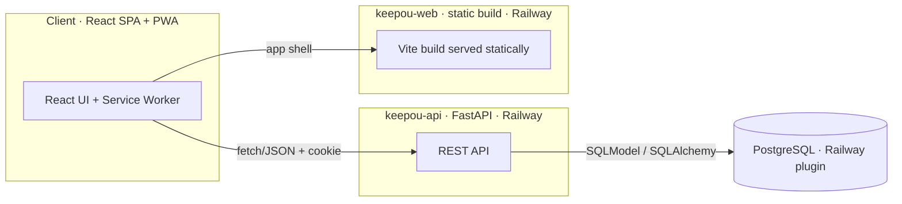
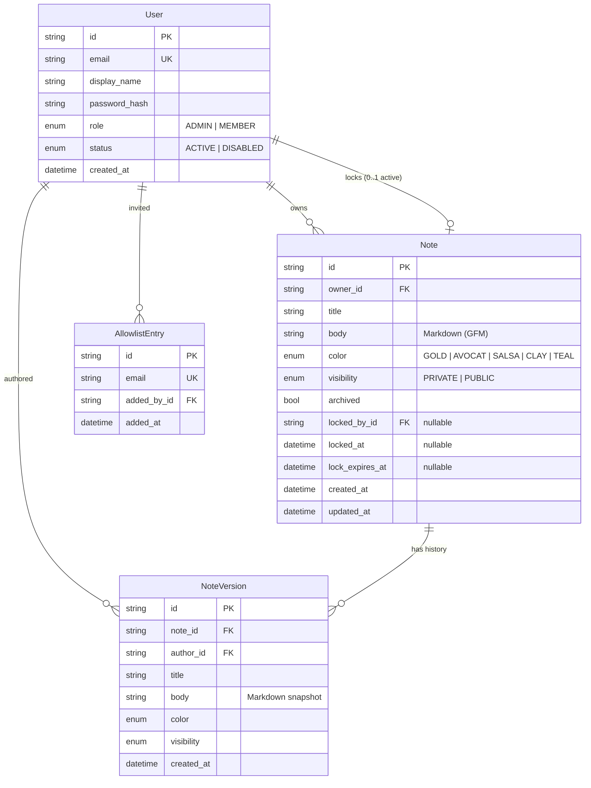
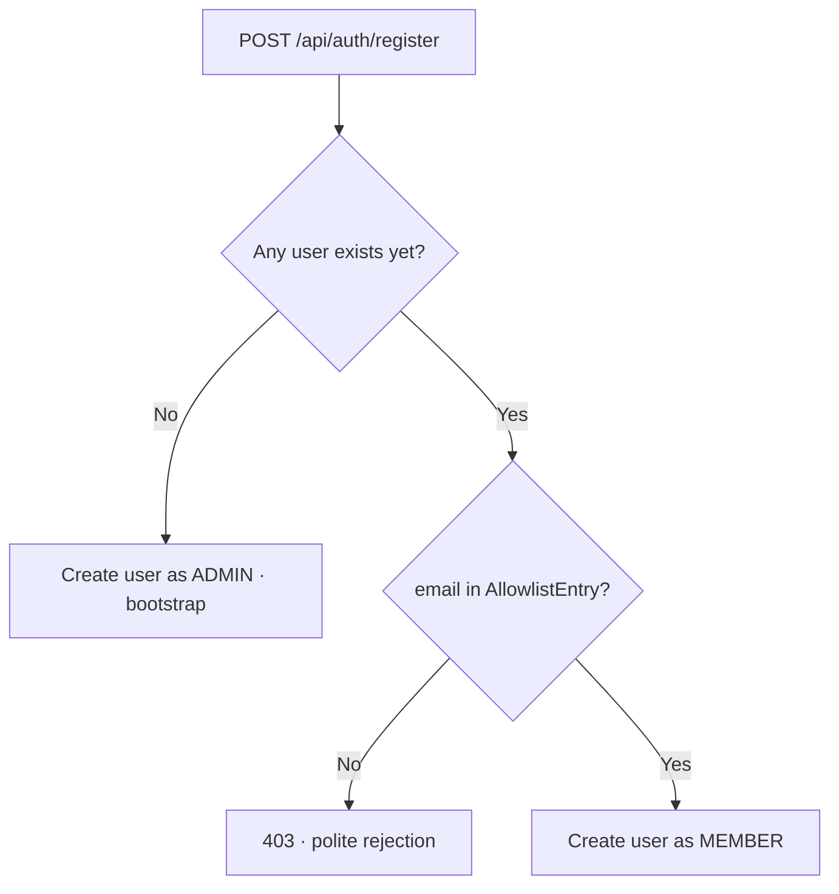
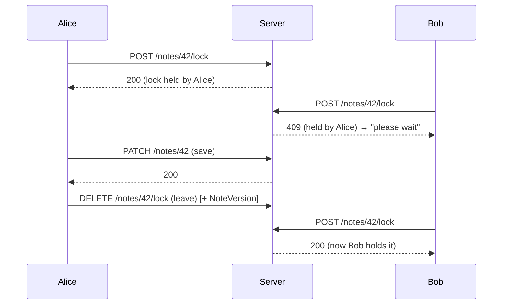

# Keepou — Architecture

**Status:** Reviewed · **Last updated:** 2026-07-01

This document describes the technical design behind the requirements in
[PRD.md](./PRD.md). It is aligned with the validated design
([../design/HANDOFF.md](../design/HANDOFF.md)) and the `api/` + `web/` scaffold.

---

## 1. Overview

Keepou is a **decoupled** application: a React single-page app (the client)
talks to a FastAPI backend (the API) over REST/JSON, backed by one PostgreSQL
database. Both run on Railway as **two services** plus the managed Postgres
plugin.



There is **no SSR**: the frontend is a static Vite build served on its own
service; the API is a separate FastAPI service. In production both sit behind
**one custom domain** — the web service serves the SPA and reverse-proxies
`/api/*` to the API — so auth is first-party (see §8); preview/dev on the default
Railway domains fall back to cross-origin + CORS. Keeping the two apart makes the
API reusable and the front trivially cacheable (see §10).

## 2. Stack & rationale

| Concern | Choice | Why |
| --- | --- | --- |
| Frontend | **React + TypeScript (Vite SPA)** | Fast dev/build, decoupled from the API, easy PWA. |
| Backend | **Python + FastAPI** | Typed, small, great for a REST API; first-class Pydantic schemas. |
| ORM / migrations | **SQLModel (SQLAlchemy + Pydantic) + Alembic** | Typed models shared with schemas; versioned migrations. |
| Database | **PostgreSQL** (prod), **SQLite** (dev) | Robust concurrency for shared notes + history; SQLite keeps local dev zero-setup. |
| Auth | **Email/password + signed session cookie** | No third-party identity provider; server-side allowlist and authz. |
| Hosting | **Railway** | Managed Postgres plugin injects `DATABASE_URL`; per-service deploys. |
| Client delivery | **PWA** (manifest + service worker) | Installable, responsive, one codebase for mobile + desktop. |

## 3. Data model

Note bodies are stored as **Markdown (GFM task lists)** — the title is a separate
field. History keeps one **version per editing session** (see §6). Passwords are
hashed; sessions are stateless signed cookies (see §8), so there is **no session
table**.



### Entity notes

- **User.role** — `ADMIN` or `MEMBER`. The first user created is `ADMIN`.
- **User.status** — `ACTIVE` / `DISABLED`. A disabled user cannot sign in; their
  data is retained (never deleted, FR-A5). The status is checked **on every
  request**, so disabling logs a user out even with a valid cookie.
- **AllowlistEntry** — the allowlist. An email here may sign up; once they do, a
  `User` row exists. A `LEFT JOIN User ON User.email = AllowlistEntry.email` lets
  the admin UI show "allowed (pending)" vs "registered" (FR-U2).
- **Note.body** — stored as **Markdown** with GFM task lists: a paragraph is
  plain text, a checkbox is `- [ ] label` (unchecked) / `- [x] label` (checked).
  Storing Markdown from the MVP means richer text can be rendered later **without
  a migration**. The reference serializer is `buildMd` in the mockups; the
  frontend mirror is `web/src/lib/markdown.ts`.
- **Note.color** — an identifier from a fixed palette (`GOLD | AVOCAT | SALSA |
  CLAY | TEAL`), not a hex value (FR-N4).
- **Note.visibility** — `PRIVATE` (owner only) or `PUBLIC` (all members),
  reversible by the owner (FR-N5); switching back to private removes it from
  others' public board.
- **Note.archived** — hides a note from the main board without deleting it
  (FR-N8). Scheduled for **E8** (not in the current mockups).
- **Note.locked_by_id / locked_at / lock_expires_at** — the single-editor lock
  carried by the note (see §5). Only meaningful on `PUBLIC` notes.
- **NoteVersion** — an immutable snapshot (title + body + color + visibility +
  author + timestamp) created once per editing session (FR-H1). Append-only; a
  composite index on `(note_id, created_at)` backs the history listing.

> **Body shape (illustrative Markdown):**
> ```markdown
> Groceries for the weekend.
>
> - [ ] Coffee
> - [x] Bread
> ```

## 4. Access control

### 4.1 Sign-up gate



The allowlist check runs **server-side**; the client only renders the message the
API returns. There is no in-app "request access" flow.

### 4.2 Permission matrix

| Action | Owner | Other member | Admin | Disabled user |
| --- | :---: | :---: | :---: | :---: |
| View private note | ✅ | ❌ | ❌¹ | ❌ |
| View public note | ✅ | ✅ | ✅ | ❌ |
| Edit private note | ✅ | ❌ | ❌¹ | ❌ |
| Edit public note content (with lock) | ✅ | ✅ | ✅ | ❌ |
| Change note visibility | ✅ | ❌ | ❌ | ❌ |
| Archive a note | ✅ | ❌ | ❌ | ❌ |
| Delete a note | ✅ | ❌ | ✅ | ❌ |
| Manage allowlist / users | ❌ | ❌ | ✅ | ❌ |

> ¹ Admins govern **access and users**, not the **content of private notes**.
> Privacy is preserved even from admins by design.

## 5. Locking mechanism (public notes)

A **pessimistic, single-writer lock** with a short TTL and a client heartbeat —
chosen over real-time co-editing for simplicity. A note carries at most one
active lock.

- **Acquire** — `POST /api/notes/:id/lock`. Granted if the note is unlocked, the
  existing lock is **stale** (`now > lock_expires_at`), or the caller already
  holds it. The grant is an **atomic conditional update**
  (`UPDATE ... WHERE locked_by_id IS NULL OR lock_expires_at < :now`); if it
  affects **0 rows**, the lock is held by someone else.
- **Heartbeat** — the editor re-calls acquire every **~20s** to extend
  `lock_expires_at` while actively editing.
- **TTL** — **~60s**. After that without a heartbeat, the lock is claimable by
  anyone. This bounds how long a closed tab can block others.
- **Enforce** — a mutating request on a **public** note is rejected with
  **HTTP 409 (Conflict)** unless the caller holds a valid (non-stale) lock; the
  response says **who** holds it.
- **Release** — `DELETE /api/notes/:id/lock` on leaving the editor (and via
  `beforeunload` / `keepalive`). Releasing the lock is what **creates the version**
  for that session (see §6).
- **UX** — when blocked, the UI shows a calm banner identifying who's editing and
  inviting the reader to try again shortly (FR-L5). Never a hard error page.



> The lock prevents **simultaneous clobbering**; **history** (next section)
> captures **who changed what**. They are complementary.

## 6. History & versions

- A note's edit is a **session**: from opening the editor to leaving it. One
  session produces **at most one `NoteVersion`** (snapshot of title + body +
  color + visibility + `author_id` + timestamp), created when the session ends —
  i.e. when the **lock is released** on a public note, or the editor is closed on
  a private note (FR-H1). Not one version per keystroke or per checkbox toggle.
- **Viewing**: `GET /api/notes/:id/versions` returns the versions newest-first,
  gated by the same visibility rules as the note itself (FR-H2). The history
  lists **who** and **when**; selecting a version re-displays it read-only
  (FR-H3). There is no visual diff — a version is shown as-is.
- **Restore**: `POST /api/notes/:id/restore/:version_id` creates a **new**
  version whose content equals the chosen one. Nothing is ever overwritten
  (FR-H4).
- **Retention**: all versions are kept (snapshots are small Markdown text).

## 7. API surface (REST, JSON)

Backend **FastAPI**; frontend **React SPA** consuming the API. Inputs/outputs are
**Pydantic** schemas; status codes via `HTTPException`. All sensitive checks
(allowlist, admin role, lock, visibility) are **server-side**.

| Method | Path | Purpose | Notes |
| --- | --- | --- | --- |
| POST | `/api/auth/register` | Create account | Allowlist-gated; bootstraps admin; `403` if not allowed |
| POST | `/api/auth/login` | Sign in | Sets session cookie; `401` bad creds, `403` if `DISABLED` |
| POST | `/api/auth/logout` | Sign out | |
| GET | `/api/auth/me` | Current user + role | Drives client route guards |
| GET | `/api/notes?tab=mine\|public` | List notes | `mine` = own; `public` = all members' public (with author); `?archived=` filter |
| POST | `/api/notes` | Create note | |
| GET | `/api/notes/:id` | Read a note | Visibility-checked |
| PATCH | `/api/notes/:id` | Update note | `title`, `body`, `color`, `visibility`, `archived`; lock-checked for public |
| DELETE | `/api/notes/:id` | Delete note | Owner or admin |
| POST | `/api/notes/:id/lock` | Acquire / heartbeat lock | `409` if held by another |
| DELETE | `/api/notes/:id/lock` | Release lock | Ends the session → writes a version |
| GET | `/api/notes/:id/versions` | Version history | Visibility-checked |
| POST | `/api/notes/:id/restore/:version_id` | Restore a version | Creates a new version |
| GET | `/api/admin/members` | Members (registered + allowed/pending) | Admin; `User` ⟕ `AllowlistEntry` |
| POST | `/api/admin/allowlist` | Add allowed email | Admin |
| DELETE | `/api/admin/allowlist/:id` | Remove allowed email | Admin; pending entries only |
| PATCH | `/api/admin/users/:id` | Set `role` or `status` | Admin; last-admin guard; never deletes |

> **Search** is a **client-side filter** over the loaded board in the MVP (FR-S1);
> a dedicated server endpoint can be added later if the note count grows.

## 8. Authentication & sessions

- Passwords hashed with **bcrypt** via **passlib** — never stored in plaintext.
- Sessions are **stateless, signed cookies** (via `itsdangerous`): the cookie
  carries a signed reference to the user, set **httpOnly + Secure + SameSite**.
  No session table is needed.
- On each request, `get_current_user` verifies the cookie signature, loads the
  user, and checks `status == ACTIVE`; `require_admin` additionally checks the
  role. Because status is re-checked every request, **deactivation takes effect
  immediately** (no waiting for a token to expire).
- **Same-site cookies (decided — see story E1-S6):** production serves the front
  and API under **one custom domain** (front `https://keepou.<tld>`, API
  reverse-proxied under `https://keepou.<tld>/api/*`), so the session cookie is
  **first-party**: `SameSite=Lax; Secure; HttpOnly`, and **no CORS** is needed.
  (Acceptable variant: sibling subdomains `app.` / `api.` on the same registrable
  domain with `Domain=.keepou.<tld>`, still `SameSite=Lax` but with CORS.) The
  default `*.up.railway.app` domains are a public suffix and can't share a cookie,
  so **preview/dev** environments fall back to cross-site `SameSite=None; Secure`
  with CORS credentials. `SameSite` and the cookie `Domain` are **env-configured**
  so prod stays on `Lax`.

## 9. PWA & responsiveness

- **Manifest** (`manifest.webmanifest`): name, icons (the mascot), theme color,
  `display: standalone`, start URL — shipped with the `web/` build.
- **Service worker**: a minimal SW for installability and app-shell caching.
  Offline editing and background sync are out of scope.
- **Theme**: `data-theme="light|dark"` on the root, CSS token variables; respects
  `prefers-color-scheme` on first load with a persisted manual override
  (localStorage).
- **Responsive layout**: CSS multi-column masonry that collapses from 4 columns
  (desktop) to 1–2 (mobile); touch-friendly targets; a single composer. The
  breakpoint is ~640px (editor: modal ≥ tablet, full-screen below).

## 10. Deployment (Railway)

One Railway project, **two services** + the managed Postgres plugin. In production
a **single custom domain** points at the **web** service, which serves the SPA and
**reverse-proxies `/api/*`** to the API service over Railway private networking —
so the session cookie is first-party (§8) and **no CORS** is needed. Each service
points at a **Root Directory** and listens on `$PORT`.

| Service | Root | Build / Start | Exposure |
| --- | --- | --- | --- |
| **keepou-web** | `web/` | build SPA + serve `dist/` on `$PORT` with **`/api` → API proxy** + SPA fallback | **public** (custom domain) |
| **keepou-api** | `api/` | Nixpacks; `uvicorn app.main:app --host 0.0.0.0 --port $PORT` | internal (via the web proxy); `/api/health` |
| **Postgres** | — | managed plugin | injects `DATABASE_URL` |

- **Migrations**: `alembic upgrade head` runs as a **pre-deploy** command on the
  API service, before traffic shifts (a no-op until the first real model lands in
  E2).
- **Continuous deployment**: pushes to the production branch redeploy both
  services; PR preview environments if the Railway plan allows.
- **Preview/dev** on the default `*.up.railway.app` domains can't share a
  first-party cookie (public suffix), so they fall back to **cross-site**
  (`SameSite=None; Secure` + CORS). Prod on the custom domain stays first-party
  `Lax` (§8).
- **Required environment variables**:

  | Variable | Service | Purpose |
  | --- | --- | --- |
  | `DATABASE_URL` | api | Postgres connection (from the Railway plugin) |
  | `SESSION_SECRET` | api | Signs session cookies (strong value in prod) |
  | `SESSION_COOKIE_SAMESITE` | api | `Lax` in prod (single domain) · `None` for cross-site preview |
  | `CORS_ORIGINS` | api | Allowed front origin(s) — only used by the cross-site fallback |
  | `VITE_API_URL` | web | API base URL, inlined **at build time** — `/api` (same-origin) in prod |

> `VITE_API_URL` is baked into the static build, so changing it requires a
> rebuild of `keepou-web`; in the single-domain setup it is simply `/api`.

## 11. Security considerations

- Allowlist enforced **server-side** on registration — never trust the client.
- Lock, visibility and admin-role checks enforced **server-side** on every
  mutating request; the lock grant is an atomic conditional update.
- Sessions are **signed** cookies (`httpOnly` + `Secure` + `SameSite`); user
  `status` is re-checked per request so deactivation is instant.
- **Last-admin guard** prevents locking everyone out of administration (FR-U5).
- **Disable, never delete** for user accounts; note deletion is restricted to the
  owner or an admin (FR-N6).
- Private-note content is shielded **even from admins** (§4.2).
- AGPL-3.0: running a modified network service obliges offering source to users.
