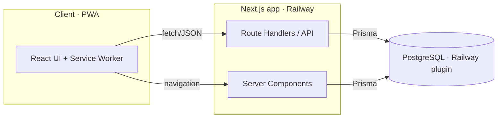
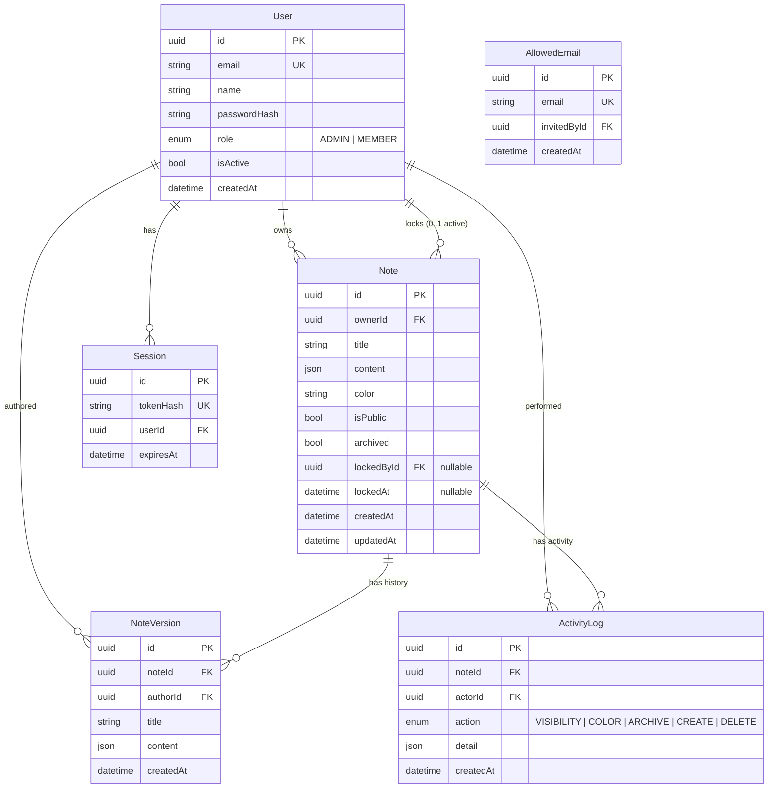
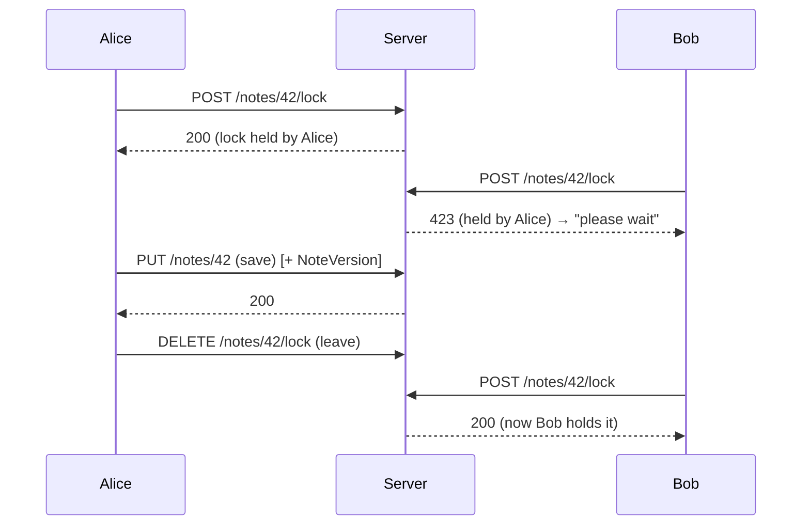

# Keepou — Architecture

**Status:** Reviewed · **Last updated:** 2026-06-26

This document describes the technical design behind the requirements in
[PRD.md](./PRD.md).

---

## 1. Overview

Keepou is a single full-stack application backed by one PostgreSQL database,
deployed as one service on Railway.



There is **no separate backend service**: the API lives in the same Next.js
project as the UI (Route Handlers). This keeps deployment to a single artifact.

## 2. Stack & rationale

| Concern | Choice | Why |
| --- | --- | --- |
| App framework | **Next.js (App Router) + React + TypeScript** | One project for UI + API, SSR for fast first paint, easy PWA. |
| Database | **PostgreSQL** | Robust concurrency for shared notes + history; first-class on Railway. |
| ORM | **Prisma** | Typed schema, migrations, good DX. |
| Auth | **Email/password + DB sessions** | No third-party dependency; works without any external identity provider. |
| Hosting | **Railway** | Managed Postgres plugin injects `DATABASE_URL`; simple deploys. |
| Client delivery | **PWA** (manifest + service worker) | Installable, responsive, one codebase for mobile + desktop. |

## 3. Data model



### Entity notes

- **User.role** — `ADMIN` or `MEMBER`. The first user created is `ADMIN`.
- **User.isActive** — deactivation flag. Inactive users cannot sign in; their
  data is retained (FR-A5).
- **AllowedEmail** — the allowlist. An email here may sign up; once they do, a
  `User` row exists. The two together let the admin UI show "allowed (pending)"
  vs "registered" (FR-U2).
- **Session.tokenHash** — only a hash of the cookie token is stored, so a DB leak
  doesn't yield usable sessions.
- **Note.content** — stored as **JSON** to natively support **checklists** (an
  array of `{ text, checked }`) alongside plain text, without a schema change if
  richer blocks are added later. A plain-text note is `{ type: "text", text }`.
- **Note.lockedById / lockedAt** — the single-editor lock (see §5). Only
  meaningful when `isPublic`.
- **NoteVersion** — immutable snapshot per content-changing save (FR-H1). Append
  only.
- **ActivityLog** — lightweight record for non-content changes (color, visibility,
  archive) and lifecycle events (FR-H4).

> **Content shape (illustrative):**
> ```jsonc
> // text note
> { "type": "text", "text": "Buy milk" }
> // checklist note
> { "type": "checklist", "items": [
>     { "text": "Coffee", "checked": false },
>     { "text": "Bread",  "checked": true  }
> ] }
> ```

## 4. Access control

### 4.1 Sign-up gate


### 4.2 Permission matrix

| Action | Owner | Other member | Admin | Inactive user |
| --- | :---: | :---: | :---: | :---: |
| View private note | ✅ | ❌ | ❌¹ | ❌ |
| View public note | ✅ | ✅ | ✅ | ❌ |
| Edit private note | ✅ | ❌ | ❌¹ | ❌ |
| Edit public note content (with lock) | ✅ | ✅ | ✅ | ❌ |
| Change note visibility | ✅ | ❌ | ❌ | ❌ |
| Delete a note | ✅ | ❌ | ✅ | ❌ |
| Manage allowlist / users | ❌ | ❌ | ✅ | ❌ |

> ¹ Admins govern **access and users**, not the **content of private notes**.
> Privacy is preserved even from admins by design.

## 5. Locking mechanism (public notes)

A **pessimistic, single-writer lock** with a short TTL and client heartbeat —
chosen over real-time co-editing for simplicity.

- **Acquire** — `POST /api/notes/:id/lock`. Granted if the note is unlocked, the
  existing lock is **stale** (`now − lockedAt > TTL`), or the caller already
  holds it. Sets `lockedById = me`, `lockedAt = now`.
- **Heartbeat** — the editor re-calls acquire every **~12s** (well under the TTL)
  to keep the lock fresh while actively editing.
- **TTL** — **~30s**. After that without a heartbeat, the lock is claimable by
  anyone. This bounds how long a closed tab can block others.
- **Enforce** — `PUT /api/notes/:id` on a **public** note is rejected with
  **HTTP 423 (Locked)** unless the caller holds a valid (non-stale) lock.
- **Release** — `DELETE /api/notes/:id/lock` on leaving the editor (and via
  `beforeunload` / `keepalive`).
- **UX** — when blocked, the UI shows a calm banner: _"🔒 Being edited by **Bob** —
  you can read it; try again in a moment."_ (FR-L5). Never a hard error page.



> The lock prevents **simultaneous clobbering**; **history** (next section)
> captures **who changed what**. They are complementary.

## 6. History & activity

- On every `PUT` that changes **title or content**, the server appends a
  `NoteVersion` (snapshot of title + content + `authorId` + timestamp) in the
  **same transaction** as the note update (FR-H1).
- Non-content changes (visibility, color, archive) and lifecycle (create/delete)
  append an `ActivityLog` entry instead (FR-H4). It is **stored for audit but not
  surfaced in the UI for now**.
- **Viewing**: `GET /api/notes/:id/history` returns the content **versions**,
  ordered newest-first, gated by the same visibility rules as the note itself
  (FR-H2).
- History is **read-only** (FR-H5): viewing past states, no restore.
- **Retention**: all versions are kept (snapshots are small text/checklist
  content).

## 7. API surface (REST, JSON)

| Method | Path | Purpose | Notes |
| --- | --- | --- | --- |
| POST | `/api/auth/register` | Create account | Allowlist-gated; bootstraps admin |
| POST | `/api/auth/login` | Sign in | Sets session cookie |
| POST | `/api/auth/logout` | Sign out | |
| GET | `/api/notes` | List own notes | `?archived=` filter |
| GET | `/api/notes?scope=public` | List public notes | Includes author |
| POST | `/api/notes` | Create note | |
| GET | `/api/notes/:id` | Read a note | Visibility-checked |
| PUT | `/api/notes/:id` | Update note | Lock-checked for public; writes a version |
| DELETE | `/api/notes/:id` | Delete note | Owner or admin |
| POST | `/api/notes/:id/lock` | Acquire / heartbeat lock | `423` if held by another |
| DELETE | `/api/notes/:id/lock` | Release lock | |
| GET | `/api/notes/:id/history` | Content version history | Visibility-checked |
| GET | `/api/search?q=` | Search notes | Own + accessible public |
| GET | `/api/admin/users` | List members (registered + allowed) | Admin |
| POST | `/api/admin/allowlist` | Add allowed email | Admin |
| DELETE | `/api/admin/allowlist/:email` | Remove allowed email | Admin |
| POST | `/api/admin/users/:id/role` | Promote / demote | Admin; last-admin guard |
| POST | `/api/admin/users/:id/active` | Activate / deactivate | Admin; last-admin guard |

## 8. Authentication & sessions

- Passwords hashed with **bcrypt** (or argon2) — never stored in plaintext.
- On login, a random token is issued; only its **SHA-256 hash** is stored in
  `Session`. The raw token lives in an **httpOnly, SameSite=Lax, Secure** cookie.
- Server Components and Route Handlers resolve the current user by hashing the
  cookie token and looking up a non-expired session, then checking `isActive`.
- No JWTs: DB sessions allow instant revocation (deactivation logs a user out).

## 9. PWA & responsiveness

- **Manifest** (`manifest.webmanifest`): name, icons, theme color, `display:
  standalone`, start URL.
- **Service worker**: a minimal SW for installability and static-asset caching
  (app shell). Offline editing and background sync are out of scope.
- **Responsive layout**: CSS multi-column masonry that collapses from 4 columns
  (desktop) to 1–2 (mobile); touch-friendly targets; a single floating composer.

## 10. Deployment (Railway)

- **Service**: the Next.js app, built and started by Railway from the repo.
- **Database**: Railway **PostgreSQL plugin**, which injects `DATABASE_URL` into
  the service environment.
- **Migrations**: `prisma migrate deploy` runs on release (pre-start), keeping the
  schema in sync.
- **Required environment variables**:

  | Variable | Purpose |
  | --- | --- |
  | `DATABASE_URL` | Postgres connection (provided by the Railway plugin) |
  | `SESSION_SECRET` | Signs/derives session material |
  | `APP_URL` | Public base URL (cookies, PWA start URL) |

- A `railway.json` / `nixpacks` config pins the build (`prisma generate && next
  build`) and start (`prisma migrate deploy && next start`) commands.

## 11. Security considerations

- Allowlist enforced **server-side** on registration — never trust the client.
- Lock and visibility checks enforced **server-side** on every mutating request.
- Session tokens stored **hashed**; cookies `httpOnly` + `Secure` + `SameSite`.
- **Last-admin guard** prevents locking everyone out of administration (FR-U5).
- Private-note content is shielded **even from admins** (§4.2).
- AGPL-3.0: running a modified network service obliges offering source to users.
